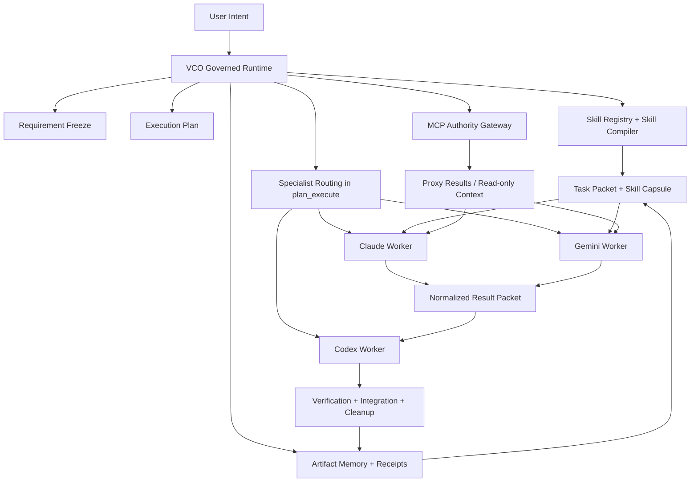

# EvCode Governed Specialist Repair Design

Date: 2026-03-18

## Scope

This design resolves four architectural tensions discussed during the specialist expansion work:

- VCO skills are powerful, but specialist CLIs have separate local memory and context
- MCP is useful, but can easily become an uncontrolled side-channel
- Claude and Gemini add planning and visual strength, but should not dilute Codex engineering authority
- the system must prove real governed value, not merely route prompts to different vendors

## Bottom-Line Recommendation

Adopt a centralized governed-specialist design:

- `VCO` remains the only control plane
- `Codex` remains the only engineering executor, integrator, verifier, and completion authority
- `Claude` and `Gemini` run as governed specialist workers
- `skills` are owned by VCO and compiled into task-specific capsules
- `MCP` is owned by the control plane and exposed to specialists only through explicit proxy or limited read-only policy
- `persistent memory` is artifact-backed and VCO-owned; specialist-local memory is explicitly non-authoritative

This is the repair path that preserves EvCode's strongest properties while still making specialist assistance real.

## Approaches Considered

### Approach A: Full native VCO inside every specialist CLI

Description:

- embed a near-complete VCO runtime into Claude CLI and Gemini CLI
- give each CLI its own local skill activation, memory behavior, MCP surface, and execution controls

Advantages:

- specialists can reason locally with fewer packet translation losses
- each CLI can perform more autonomous work

Disadvantages:

- creates split-brain control risk
- duplicates governance logic across multiple runtimes
- dramatically increases debugging, audit, and credential complexity
- encourages drift in requirement, receipt, and cleanup semantics

Judgment:

- reject as the first stable repair path
- may be explored later only for tightly scoped worker packaging, not as parallel control planes

### Approach B: Minimal external delegation with no shared governance substrate

Description:

- Codex manually forwards selective tasks to Claude or Gemini
- specialists reply with free-form output
- Codex uses judgment to integrate results

Advantages:

- low engineering lift
- easy to prototype

Disadvantages:

- skills are not systematically reused
- no packet or receipt discipline
- MCP usage becomes ad hoc
- weak reproducibility and poor auditability

Judgment:

- acceptable only for informal experiments
- not acceptable as EvCode product architecture

### Approach C: Centralized VCO control plane with governed specialist workers

Description:

- VCO owns routing truth, skills, memory truth, MCP authority, receipts, and cleanup
- specialists operate through explicit task packets and authority tiers
- Codex receives specialist output and performs final engineering integration and verification

Advantages:

- preserves one control plane
- makes skill reuse systematic
- keeps MCP safe and auditable
- allows phased rollout from advisory-only to stronger delegation
- supports real proofs of governance and operator value

Disadvantages:

- requires packet contracts, proxy layers, and artifact discipline
- more complex than simple prompt forwarding

Judgment:

- recommended
- this is the repair design

## Architecture

## Core Design Rules

### 1. One control plane, many workers

Specialists are workers, not peers of the runtime.

VCO continues to own:

- requirement freezing
- execution planning
- authority-tier decisions
- routing policy
- verification gates
- receipts and cleanup

Specialists may advise or produce candidate artifacts, but they do not become route truth or completion truth.

### 2. Skills belong to VCO, not to per-CLI private memory

VCO should maintain the authoritative skill registry.

Skill usage is repaired through a `skill compiler` that converts long-form skill material into a task-specific `skill capsule` containing:

- relevant rules
- required output shape
- task-specific constraints
- repo facts that matter for the current delegation
- prohibited actions and non-goals

This prevents the system from depending on whether Claude or Gemini remembered a prior turn.

#### Skill categories

`Control-plane-only skills`

- `vibe`
- verification and cleanup policies
- benchmark suppression rules
- routing and authority policies
- provider failure and degradation behavior

These never leave the control plane as executable authority.

`Compiled delegation skills`

- documentation style and report structure
- design critique rubrics
- visual quality heuristics
- architecture analysis templates
- UX framing rules

These can be compiled into specialist capsules.

`Tool-bound skills`

- GitHub, browser, Figma, filesystem, shell, or other strong external integrations

These are only usable through control-plane mediation unless a specific read-only delegation policy says otherwise.

### 3. Persistent memory is artifact-backed and VCO-owned

The system of record should be artifact-backed, not model-internal.

Authoritative memory surfaces:

- requirement documents in `docs/requirements/`
- design and execution plans in `docs/plans/`
- result and cleanup receipts in `outputs/runtime/vibe-sessions/`
- config and policy in `config/`
- deterministic tests in `tests/`

Non-authoritative memory surfaces:

- specialist-local conversational memory
- provider-local hidden context
- ad hoc per-turn model recollection

Rule:

- specialist-local memory may improve fluency, but never overrides governed artifacts

### 4. MCP is a capability transport, not a second orchestrator

MCP must be centralized under control-plane governance.

#### Default policy

`Codex-only MCP`

- filesystem write
- shell execution
- GitHub write actions
- receipt emission
- cleanup and process management
- any high-side-effect mutation capability

`Proxy-mediated MCP`

- specialist requests a capability
- VCO decides whether to allow it
- Codex or the host bridge executes it
- results are normalized and fed back into the specialist packet

`Limited read-only MCP`

- Figma read
- docs or issue lookup
- repository metadata queries
- screenshots or page structure reads

These may later be exposed directly to specialists behind explicit allowlists, but only after stability proof.

### 5. Delegation happens inside `plan_execute`

Specialist routing does not own route truth.

The runtime must first freeze requirements and a plan, then perform delegation within the plan's execution boundaries.

This keeps benchmark suppression, auditability, and rollback intact.

## Authority Tiers

### Tier A: Advisory only

- specialists may produce plans, critiques, candidate code, design tokens, and rationale
- specialists may not claim completion
- specialists may not directly land repository truth
- Codex must review, integrate, verify, and finalize

This is the required first stable rollout.

### Tier B: Isolated candidate apply

- specialists may write candidate artifacts in isolated worktrees or delegation sandboxes
- outputs remain candidate diffs, not accepted truth
- Codex still owns all integration and completion claims

This is appropriate only after advisory proof is stable.

### Tier C: Narrow direct apply

- optional future state
- only for low-risk presentational scopes with hard guardrails
- still subject to Codex-led verification and rollback

This tier is explicitly out of scope for the first repair rollout.

## Task Packet Contract

Every specialist call should use a normalized task packet with the following sections.

### Required fields

- `task_id`
- `run_id`
- `specialist`
- `goal`
- `file_scope`
- `constraints`
- `acceptance_criteria`
- `non_goals`
- `repo_context_summary`
- `authority_tier`
- `expected_output_type`
- `skill_capsule`
- `allowed_capabilities`
- `required_receipts`

### Optional fields

- `figma_context`
- `screenshots`
- `design_token_inventory`
- `issue_or_pr_context`
- `backend_api_constraints`
- `existing_component_inventory`

## Result Contract

Every specialist response must be normalized before Codex consumes it.

### Required fields

- `specialist`
- `task_id`
- `summary`
- `assumptions`
- `proposed_actions`
- `proposed_files`
- `confidence`
- `unresolved_risks`
- `recommended_next_actor`
- `capability_requests`
- `receipt_refs`

### Optional fields

- `patch`
- `design_tokens`
- `screenshot_refs`
- `alternate_variants`
- `operator_notes`

## Receipt Model

Every governed delegation should produce the following receipts.

- routing receipt
- task packet receipt
- capability proxy receipt if MCP or other mediated tools were used
- specialist result receipt
- Codex integration receipt
- verification receipt
- cleanup receipt

These receipts are what make the system governed rather than merely multi-model.

## Validation Strategy

### Functional validation

- routing selects the intended specialist set for representative planning, visual, mixed UI, backend, and benchmark tasks
- task packets remain deterministic under fixed policies
- provider failures degrade cleanly without corrupting the run

### Governance validation

- no specialist bypasses requirement freeze or plan traceability
- benchmark policy suppresses specialist delegation when required
- MCP write access cannot be invoked outside Codex-authorized surfaces

### Intelligence validation

- Claude improves requirement articulation, alternative analysis, and document quality
- Gemini improves visual specificity, design variety, and presentational quality
- Codex successfully translates specialist outputs into coherent engineering plans and final changes

### Stability validation

- repeated runs with the same policy produce comparable routing and receipt structures
- provider outages degrade to advisory suppression or Codex-only execution rather than undefined behavior
- no hidden dependency on specialist-local memory is required for correctness

### Usability validation

- operators can understand who acted, why, and with what authority
- `doctor`, `status`, and future governance introspection surfaces explain specialist and MCP policy succinctly

## Migration Strategy

### Phase 1: Control-plane repair and clarity

- codify authority, memory, skill, and MCP rules in docs and config
- expose policy in operator-facing docs and status output
- keep specialists advisory-only

### Phase 2: Skill capsule and proxy mediation

- implement skill compilation and capability-request mediation
- allow specialist requests for repo, issue, design, and screenshot context through proxy
- preserve Codex-only mutation powers

### Phase 3: Isolated apply for low-risk UI work

- allow Gemini and optionally Claude to generate candidate artifacts in isolated sandboxes
- require Codex normalization and verification before integration

### Phase 4: Evidence-rich operations

- add richer visual proof, policy introspection, and failure analytics
- only then consider narrow direct-apply pilots if they remain justified

## Failure And Degradation Rules

Allowed degradation:

- specialist unavailable
- provider unavailable
- MCP enhancement unavailable
- skill compiler fallback to minimal capsule
- specialist suppressed by benchmark or policy

Not allowed:

- silent widening of authority
- bypassing requirement docs or plans
- specialists claiming repository completion
- uncontrolled write-side MCP exposure
- hidden dependence on private specialist memory

## Final Design Judgment

The repair should not try to make every CLI carry a full native copy of the EvCode universe.

It should make VCO the source of truth for:

- governance
- skills
- MCP authority
- persistent memory
- receipts
- cleanup

Then it should let Claude and Gemini contribute as narrowly governed specialists, with Codex acting as the one place where specialist value becomes repository truth.
